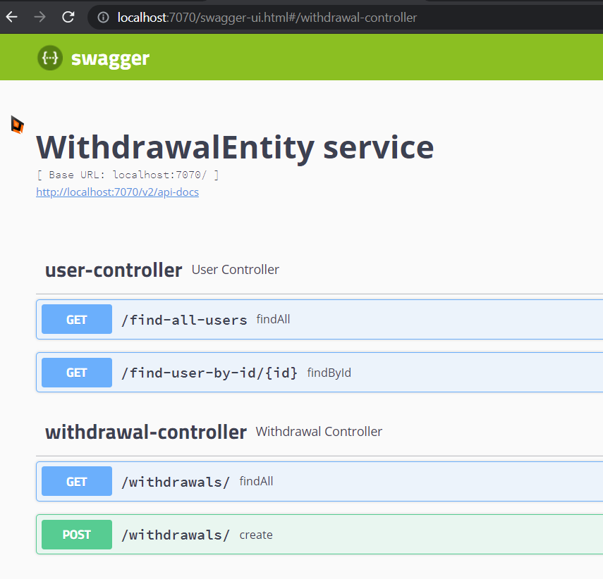

### Technical challenge (for developers)

Assume we have a big legacy system and one of the parts is withdrawal processing (the process that allows to transfer money from company to employee accounts). Now we have chance to completely rewrite the system, including API change (endpoints, DTOs etc). As a techical challenge we suggest you to take it (NOTE: we are interesting to see a new withdrawal processing only). You can do whathever you want following the acceptance criteria:

- Use any architecture you are comfortable with 
- Use modern Java or Kotlin (we use Kotlin for new code)
- Use Spring boot
- Use any database SQL/NoSQL (please use embedded)
- The code must be tested
- The service should be easy to run (e.q. docker-compose)

#### Here are some business rules of the withdrawal processing:

- We have a list of users (`/find-all-users` endpoint)
- A user has several payment methods
- A user can execute a withdrawal request using one of his payment methods
- A withdrawal can be executed as soon as possible or be scheduled to execute later
- After the service receives a request it stores a withdrawal object in our DB and sends a request to a payment provider async. Note: for this task we don't care about a transaction completion  
- We noticed that in current solution we are losing some outgoing events about withdrawalEntities. We MUST 100% notify listeners regarding any withdrawal statuses. That means a new solution should be designed to cover the requirement. For example a withdrawal has been sent to provider, we updated a status to processing in database, and then we have to send a notification. What if the notification was failed to send (e.q. connection issues)?  

#### Steps to proceed:

- Fork the repository (in case you want to refactor the existing solution). Or you can create the project from scratch
- Implement your nice solution
- Once complete invite `makcon` and `pbravowezaam` for review

# Solution
Withdrawal application
* Division into independent layers trying to follow the DDD methodology and SOLID principles.

* Use of DTO to transport information through the layers.

* A factory for whitdraw objects was created to provide for the creation of new types of Whitdraw objects.

* Creation of specialized services to notify and another to retry failed transactions.

* Test for the suite of services

* Error handler for normal exceptions as well as those of the application.


Future improvements:

-Using a single entity to persist data

-Better retry policy implementation.


* How Run this App:
  - 
  You will need to first build with Maven; use the below command, please run it from the project folder which contains the pom.xml file.
     ```
     mvn package
     ```
  To run Profile app from a command line in a Terminal window you can run the java -jar command. This jar is provided where the Profile app was packaged as an executable jar file.
     ```
     java -jar target/wezaam-withdrawal-service-qa-1.0.jar
     ```      
  Also you can build image using Docker:
    ```
  docker build -t fredySanabria/wezaam-withdrawal-service .
    ```
  And run the image:
    ```
  docker run -p 7070:7070 fredysanabria/wezaam-withdrawal-service
    ```  


* Documentation and Endpoints:
  - 


Now you are be able to see the Swagger documentation about API
 

* Technologies:
  - 

+ BackEnd
  It's a Rest API developed with Java 15 and Kotlin using SpringBoot framework, JPA repository in H2 embedded database.
  
  
    
             
