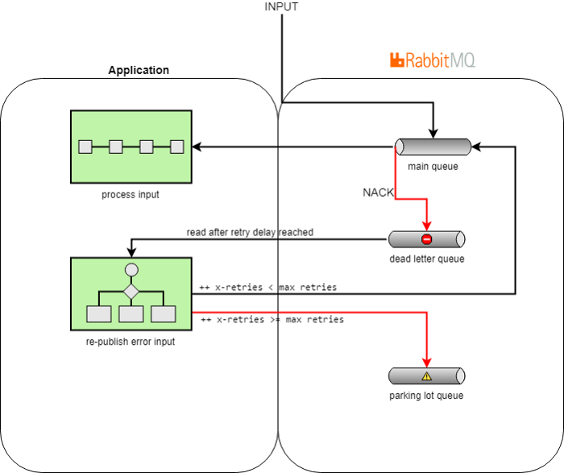

# Getting Started

To implemente this challenge, I have decided to create the project from scratch. To do so, I have defined the following multi-modules project based on microservice architecture:
- weezam-registry: it is based on Spring Cloud Netflix Eureka server in order to implement the discovery pattern.
- weezam-gateway: it is based on Spring Cloud Gateway. This module will be responsible for expose the API.
- weezam-user: Microservice responsible for implementing endpoints which allow us to operate with Users & PaymentMethods.
- weezam-withdrawal: Microservice responsible for implementing the logic in order to support the withdrawal processing.
- weezam-notifications: Microservice responsible for processing the notifications from withdrawal processing.

Each of them has been implemented using a [Hexagonal architecture](https://en.wikipedia.org/wiki/Hexagonal_architecture_(software)). I am using the following package structure:
- domain:
  - model: It contains Model class
  - aggregate: It contains the business services
  - repository: It contains Repository interfaces
- adapter:
  - in
    - amqp: It contains Message Broker Listener
    - rest: It contains Rest API
  - out
    - amqp: It contains Message broker publisher
    - persistence: It contains Repository implementation
    - client: It contains Rest clients 
- Config: It contains spring config class.

Also, I have prepared a docker-compose file in order to run all the modules together.

# Message Broker

I am using RabbitMQ as JMS provider. Also, I am using Rabbitmq_delayed_message_exchange as plugin in order to scheduler withdrawals.
* [Scheduling messages with rabbitmq](https://blog.rabbitmq.com/posts/2015/04/scheduling-messages-with-rabbitmq)

Apart from this, I have implemented the `dead-letter queue + parking-lot queue` approach in order to avoid losing some outgoing events about withdrawals



# Build

```
mvn clean package
```

# Run

```
docker-compose up --build
```

## Links project
- [Weezam Registry DASHBOAR](http://localhost:8761)
- [RabbitMQ](http://localhost:15672)
  - User: `guest`
  - Password: `guest`

## Postman
[Weezam Postman Collection](docs/weezam.postman_collection.json)

## Testing

Since, I have not had enough time. I have just included some test cases in weezam-user module. I apologies for that.