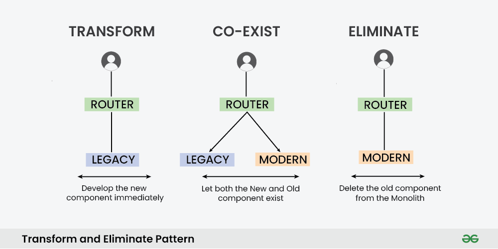
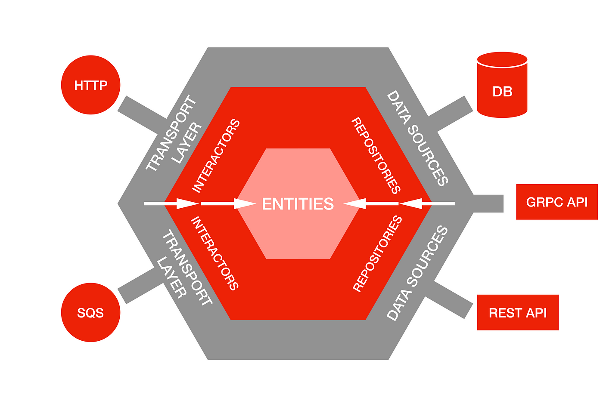
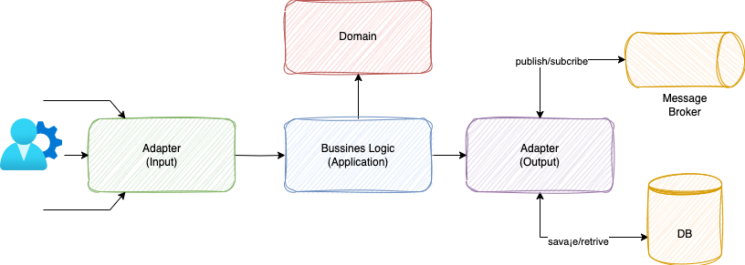
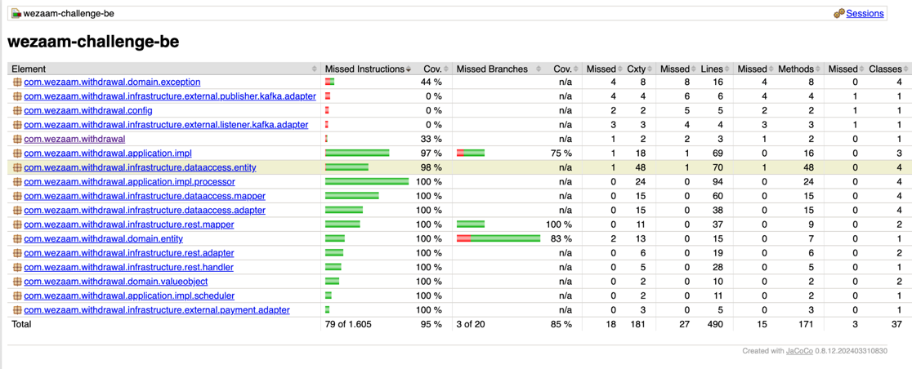
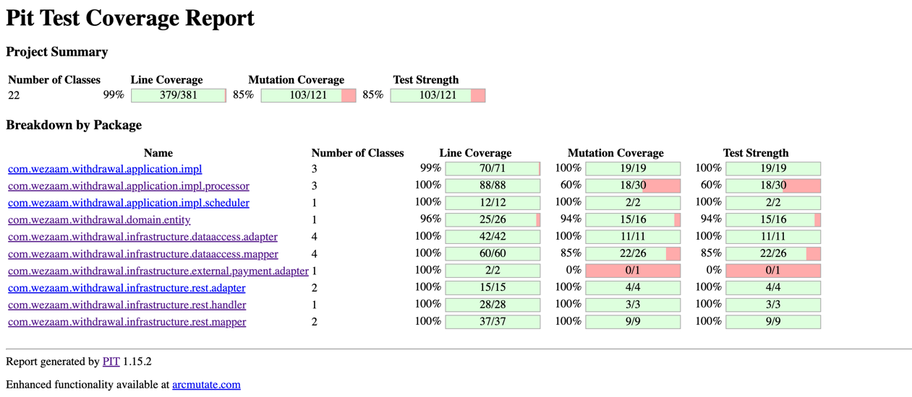

# Withdrawal API

### Technical challenge (for developers)

Assume we have an extensive legacy system and one of the parts is withdrawal processing (the process that allows to transfer money from company to employee accounts). Now we have a chance to completely rewrite the system, including API change (endpoints, DTOs etc). As a technical challenge, we suggest you to take it. You can do whatever you want following the acceptance criteria:

- Use any architecture you are comfortable with
- Use modern Java or Kotlin (we use Kotlin for new code)
- Use Spring boot
- Use any database SQL/NoSQL (please use embedded)
- The code must be tested. We don't expect 100% coverage for this challenge, we want to see that you can write sensible tests. For example, if you have several similar converters, there is no need to test every single class/method, just enough to test one. But for critical logic like the withdrawal process we'd like to see coverage of different scenarios
- We expect to see SOLID principles in action

#### Here are some business rules for withdrawal processing:

- We have a list of users (`/find-all-users` endpoint)
- A user has several payment methods
- A user can execute a withdrawal request using one of his payment methods
- A withdrawal can be executed as soon as possible (note: it doesn't mean immediately) or scheduled to be executed later
- After the service receives a request it stores a withdrawal object in our DB and sends a transaction request to a payment provider async. Note: for this task, we don't care about a transaction completion

###### As a bonus please describe (or implement a solution) how to solve the problem:

We noticed that in the current solution, we are losing some outgoing events about withdrawals. We MUST 100% notify listeners regarding any withdrawal statuses. For example: in `WithdrawalService.processScheduled`method, we updated the status to processing in the database (line 89), and then we sent an event (line 90). What if the event failed to send (e.q. connection issues to a messaging provider)?


# Solution
The project was refactored using hexagonal architecture and domain driven design,
for that I've used some pattern to help me how to migrate legacy code to the new architecture.

## Strangler pattern


Benefits of Strangler

* The Strangler pattern allows for graceful migration from a service to one or more replacement services.
* If implemented properly, with the ability to “roll back”, the pattern allows relatively low risk in migrating to new service(s).
* The pattern can be used for versioning of APIs.
* Similar to versioning above, the pattern can be used for legacy interactions (the old service remains for solutions that aren’t or won’t be upgraded).

## Hexagonal architecture



* Clear Separation of Concerns
* Enhanced Testability
* Improved Flexibility and Scalability
* Enhanced Portability
* Future-Proofing Your Application

# High level model solution



# stack
* Java 21
* Spring boot 3.3.X
* Spring jpa
* Spring docs (swagger)
* Hibernate
* Maven
* Git
* Lombok
* Docker 
* Docker Compose
* Junit 5
* Mockito
* Jacoco
* Spotless
* Pitest-Mutation testing
* PostgresSQL
* H2

# How it works

Steps to execute test, compile and create jar file

To execute test, open a console in the path project

  ````shell
    mvn clean test
  ````

To run project you have 2 choices

1. Execute in a console, copy and paste the following command

    ````shell
    mvn spring-boot:run
    ````
2. Execute using docker, open console and copy and paste the following command

    ````shell
    docker compose up --build -d
    ````
### changes
* User endpoint to get all user was renamed from `/find-all-user` to `/users`
* User endpoint to get user info was renamed from `/find-user-by-id/{id}` to `/users/{id}`
* Withdrawal endpoint to get all withdrawals was renamed from `/find-all-withdrawals` to `/withdrawals`
* Withdrawal endpoint to create a new withdrawal request was renamed from `/create-withdrawals` to `/withdrawals`

**NOTE**: For all endpoints it was used all http method GET and POST 


# Testing

for testing, it was created unit test using junit 5 and mockito. 

### Coverage



### Mutation

Mutation testing is designed to ensure the quality of a software testing 
tool, not the applications it analyzes. Mutation testing is typically used to conduct unit tests. 
The goal is to ensure a software test can detect code that isn't properly tested or hidden defects that other testing methods don't catch.



## Contributing

None

## Versions

1.0.0

## Authors

* Lewis Florez

## License

Technical test for CloudPay company

## Acknowledgements

I would like to say thank you for give the opportunity to participate in this challenge.

## Additional notes

Regarding the premise that: I propose to use in this kind solutions Kafka as Event sourcing and apply Saga pattern
to send and receive messages, and also combine with Avro it is a strong combination.

It was not implemented, but I create a fake interfaces to simulate that integration.

For bonus track, in case of error when try to save the new Processing status implement a DLQ and re-process that in batch
