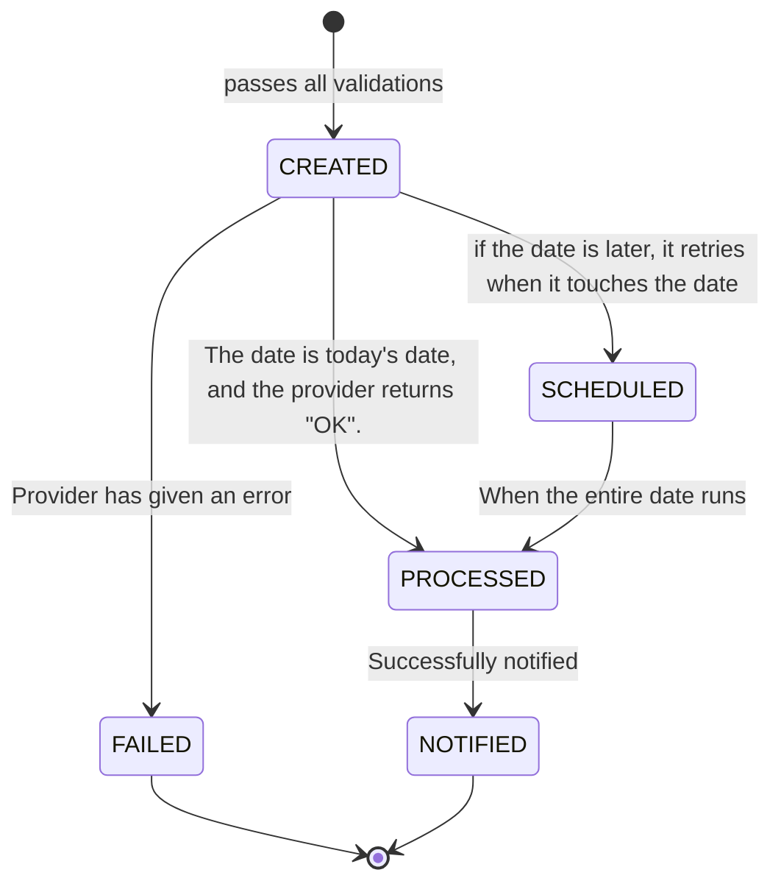
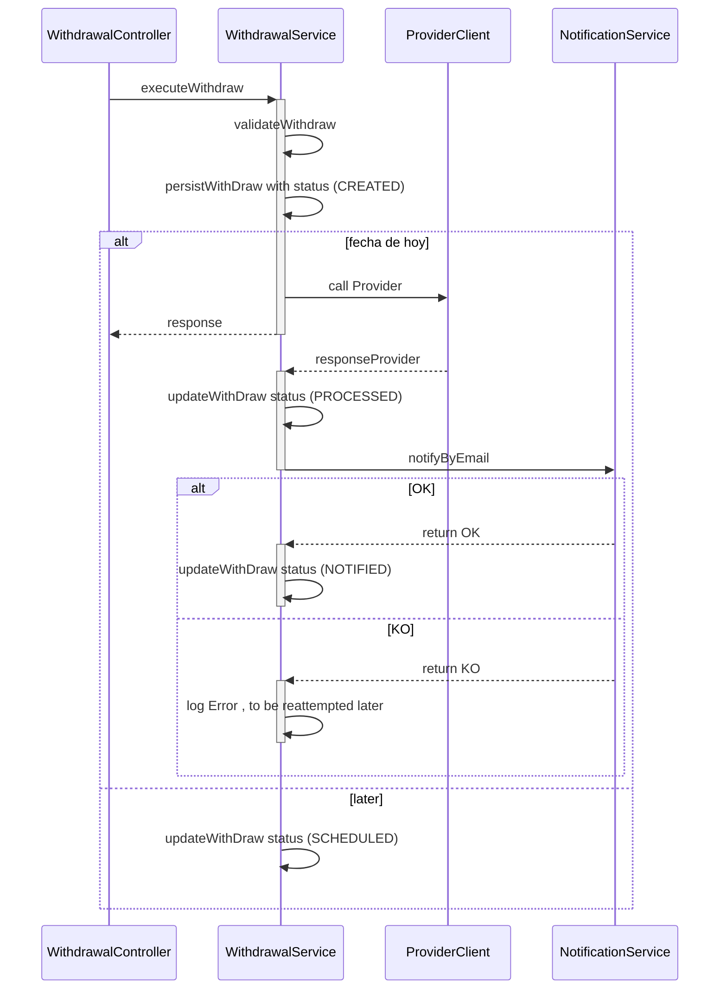
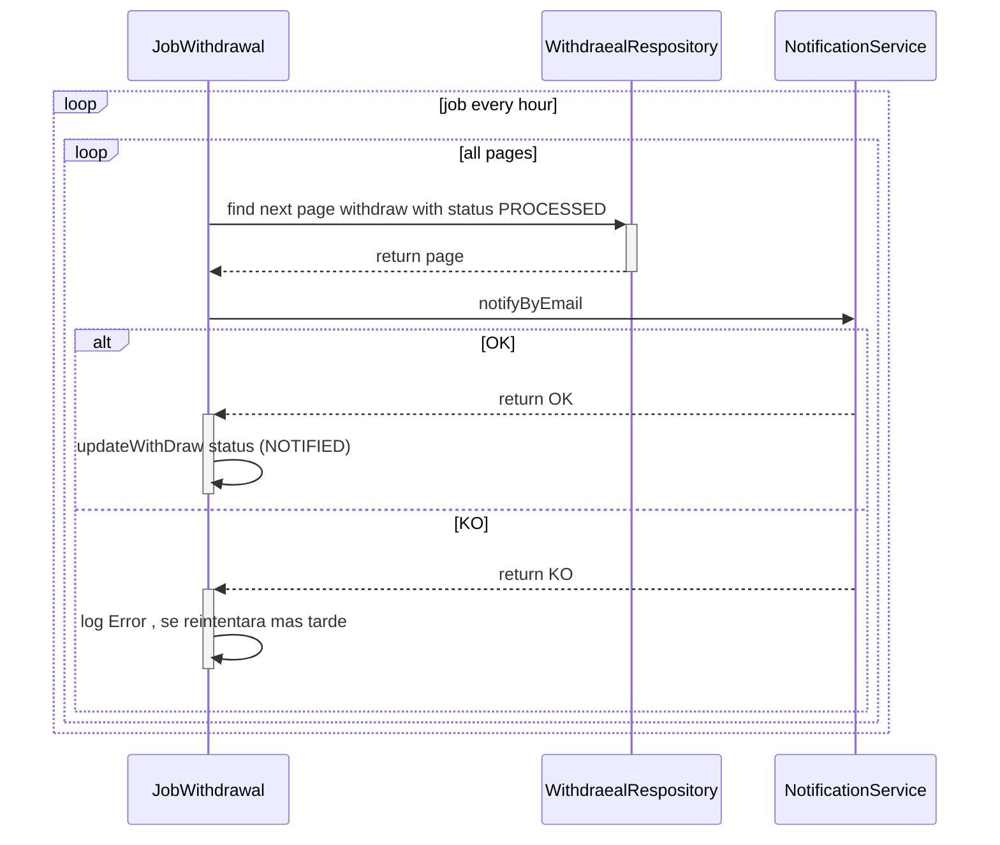
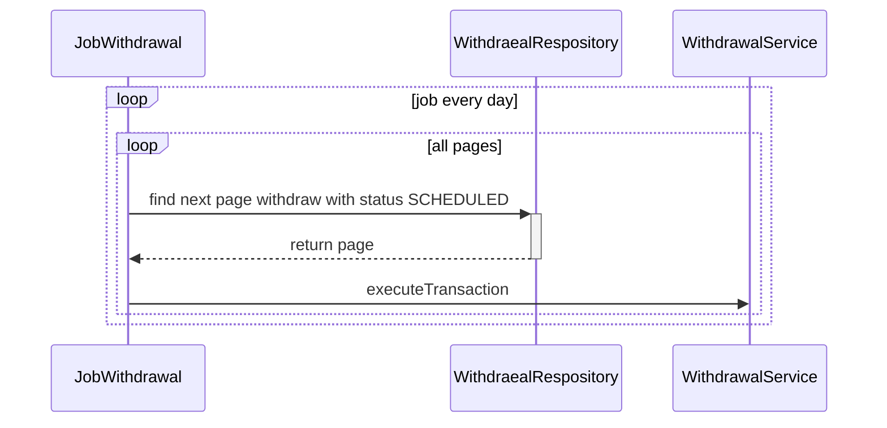

**1. AC**

        As an employee, I want to be able to create a withdrawal.
        
        As an employee want to be able to create an instant or
       scheduled withdrawal. 
       
        As an employee want to be able to create a withdrawal with one
       of my payment methods.
       
       As an employee want to be able to receive an email notification
       when the transaction fails.
       
       As an employee want to be able to receive an email notification
       when the transaction is successfully processed.

**2. Technology**

- Java 11
- SpringBoot
- Spring Data
- Spring webflux
- Notification Service (AWS SES )
- Lombok
- h2database
- Mapstrut

**3. Architectural solution diagram**

- States of the entity withdraw



- The service sequence diagram is :



- Notification retry job sequence diagram :



- Job sequence diagram for executing scheduled operations:



**4.description of the development**

***Note :***

1. We created an endpoint in the same project in order to "*simulate an asynchronous call to the provider to execute the
   transaction*",although it is not displayed at swagger-ui level."http://localhost:8080/validation"

2. In order to test and receive an email notification on the status of the withdrawal, you have to create an account in
   AWS SES in the access/secret key modification and validate your email or provide me with the test email to validate
   it.

3. When looking for a logical functional solution, some functional and technical decisions have been made in order to
   create a complete solution.

4. How to test ? url -> http://localhost:8080/withdrawal

``` json 
 {
   "employeeId":  "XY123456",
   "paymentMethod":  "BBVA",
   "withdrawalAmount":  109.8,
   "executionDate":  "2022-03-05",
   "currency":  "EUR"
  }
```

``swagger --> http://localhost:8080/swagger-ui.html#/ ``

``initial data load is in resources/import.sql``

***Technical specifications:***

```
- All input fields are mandatory.
- The employee_id must exist in the EMPLOYEES table.
- The payment method must exist as one of the employee's payment methods in the PAYMENT_METHODS table.
- The amount requested must be less than the employee's total balance.
- The employee can only request 1 withdrawal and cannot request another one until the previous one is processed.

- Withdrawals requested on the same day are requested asynchronously from the provider and the employee is then notified
  of their status by e-mail.
-
- Scheduled withdrawals will be saved in the WITHDRAWS table for later execution with a Scheduler.# every 5 minute

-A Scheduler has been created to be able to execute all scheduled transactions in the SHEDULED status. # every day at 00:00:00

-A Scheduler has been created to be able to execute all the transactions that have had an error of notification to the
employee and have remained in the PROCESSED state instead of NOTIFIED due to any error of the system of notifications.
```